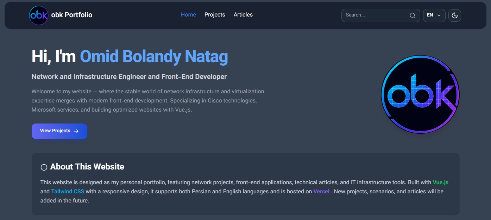
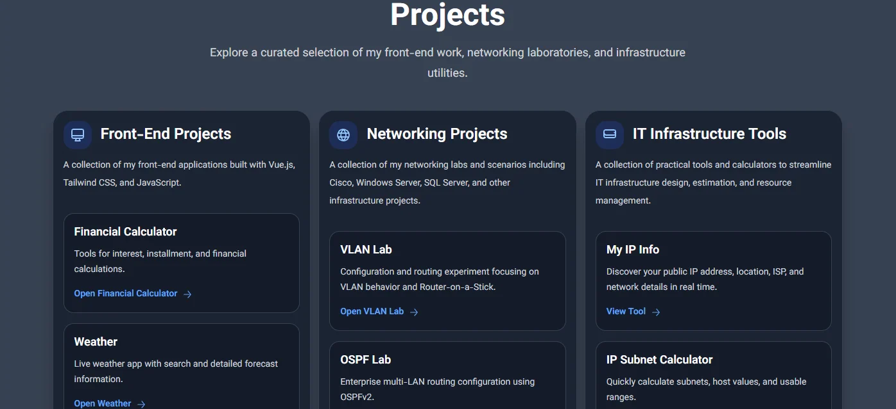
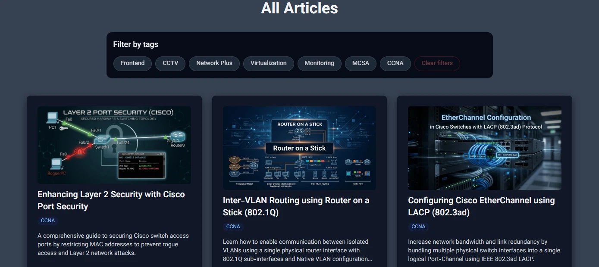

# 🌐 IT Portfolio Website

A modern bilingual portfolio website built to showcase my IT skills, projects, and technical articles.

<a href="https://vuejs.org/" target="_blank">
  
</a>

[](https://tailwindcss.com/)
[](https://obkworks.tr)

<a href="https://www.cloudflare.com/dns/" target="_blank">
  
</a>

[](https://obkworks.tr)

## 🚀 Live Portfolio

https://obkworks.tr

---

## ℹ️ Project Information

- **Version:** 1.0.13
- **Status:** Stable
- **License:** © 2026 obk Portfolio. All rights reserved.

---

## 📖 About

This website was developed as a personal portfolio to demonstrate practical experience in networking, system administration, virtualization, monitoring, and web development.

The project is fully responsive and supports both Persian (RTL) and English (LTR).

---

## ✨ Features

- 🌍 Bilingual (Persian / English)
- 🌙 Dark & Light Theme
- 📱 Responsive Design
- 🌦 Weather Application
- 📅 Date & Time Utilities
- 🧮 IT Infrastructure Tools
- 📚 Technical Articles
- 💻 Front-end Projects
- 🌐 Network Projects
- 🔐 Secure Weather API using Cloudflare Pages Functions

---

## 🛠 Built With

### Front-end

- HTML
- CSS
- Vue.js 3
- Vue Router
- Vue I18n
- Tailwind CSS
- JavaScript (ES6+)

### Deployment

- GitHub
- Cloudflare DNS
- Vercel

### APIs

- OpenWeatherMap API
- ExchangeRate API

---

## 📂 Project Categories

### Front-end Projects

- Financial Calculator
- Weather Application (Secure Weather API using Cloudflare Pages Functions)
- Todo List
- Calendar
- Unit Conversion
- QR & Barcode Generator
- BMI Calculator
- Calculator
- Time & Date
- Modals

### Network Projects

- VLAN Lab
- OSPF Lab
- EIGRP Dynamic Routing
- EtherChannel (LACP) Configuration
- Access Control Lists (ACL)
- Port Security & DHCP Snooping
- Active Directory, GPO & FSRM
- DHCP Failover & DNS Lab
- SQL Server & T-SQL Lab Scenario

### IT Infrastructure Tools

- IP Subnet Calculator
- CCTV Storage Calculator
- RAID Calculator
- VM Resource Allocator
- Data Unit Converter

---

## 📷 Screenshots

### 🏠 Home Overview



### 🛠️ Projects & Infrastructure Tools



### 📚 Technical Articles



---

## 📦 Installation

```bash
git clone https://github.com/omidbolandy/repo-name.git
cd repo-name
npm install
npm run dev
```

---

## 📈 Future Improvements

- More Infrastructure Tools
- Additional Network Labs
- More Technical Articles
- Performance Improvements
- New Interactive Utilities

---

## 👨‍💻 Author

**Omid Bolandy Natag**

- GitHub: [omidbolandy](https://github.com/omidbolandy)
- Website: [obkworks.tr](https://obkworks.tr)
- LinkedIn: [Omid Bolandy](https://www.linkedin.com/in/omid-bolandy/)

---

## 📄 Notice

This repository is intended for portfolio and demonstration purposes.

If you would like to use any part of this project, please contact the author first.

---

⭐ If you found this project useful, consider giving it a Star.
